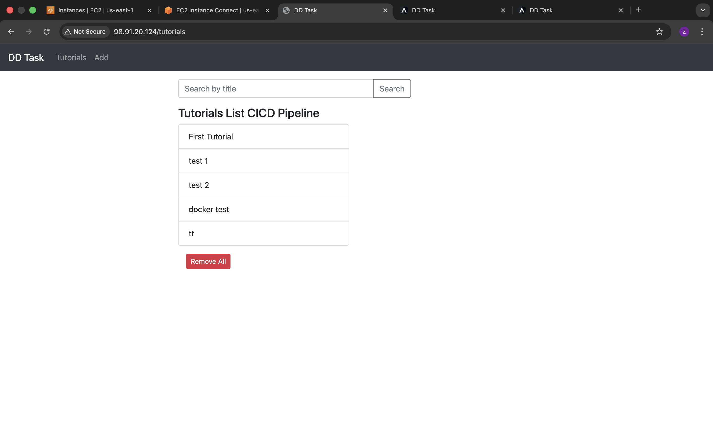
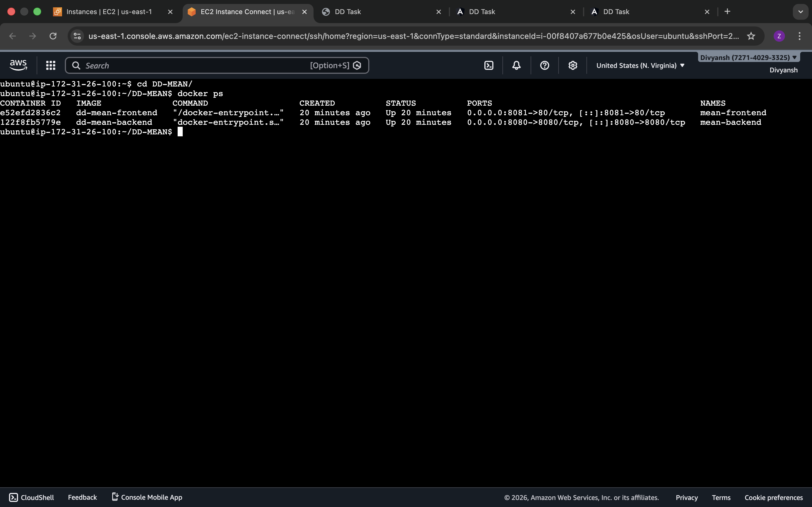
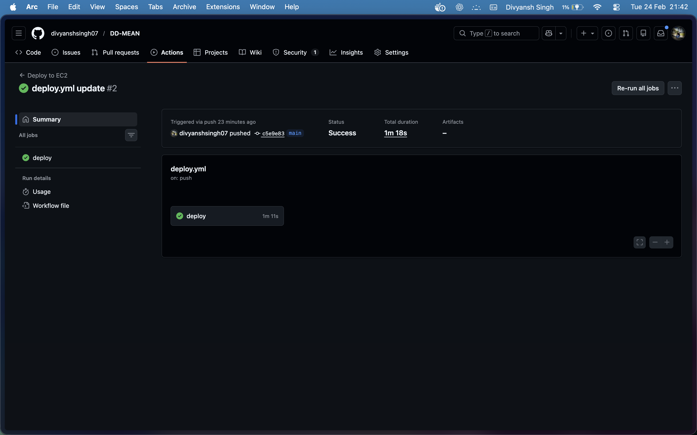
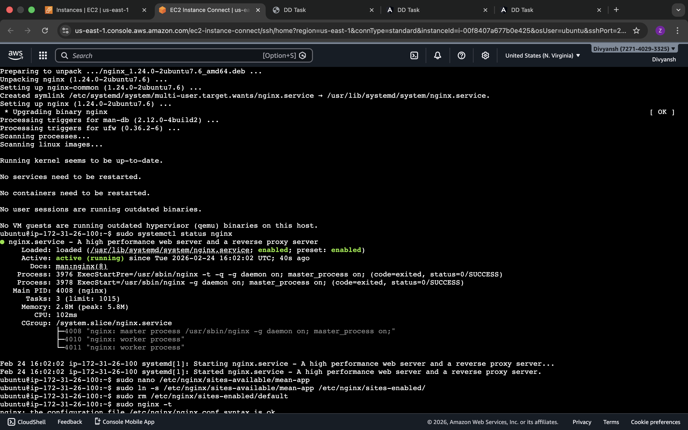

## Project Overview

This project is a full-stack CRUD application built with the **MEAN stack**:

- **MongoDB Atlas** for data storage  
- **Express + Node.js** for REST APIs  
- **Angular 15** for the frontend  

The app manages a collection of tutorials (ID, title, description, published status) with full CRUD operations and search by title.

In addition to the application code, this repository demonstrates:

- **Docker** containerization for backend and frontend  
- **docker-compose** orchestration  
- **Deployment to AWS EC2**  
- **GitHub Actions CI/CD** to automatically deploy on push to `main`  
- **Nginx reverse proxy** on the EC2 host

---

## System Block Diagram (Visual)

The following diagrams show the end-to-end flow from the developer and user all the way to MongoDB Atlas, including CI/CD, Docker, Nginx, EC2, and the MEAN stack:




---

## Architecture (Logical View)

High-level request flow:

- **User → Nginx (port 80)**  
  - `/` forwarded to **frontend container**  
  - `/api/...` forwarded to **backend container**  
- **Backend → MongoDB Atlas** using the connection string in `backend/app/config/db.config.js`

---

## Repository Structure

- `backend/` – Node.js + Express REST API (Tutorials CRUD)
- `frontend/` – Angular 15 SPA
- `docker-compose.yml` – runs backend and frontend together
- `backend/Dockerfile` – backend container image
- `frontend/Dockerfile` – frontend build + Nginx container
- `ngnix/default.conf` – Nginx reverse proxy config for EC2 host
- `.github/workflows/deploy.yml` – GitHub Actions CI/CD workflow

---

## Local Development (without Docker)

### Backend (Node.js + Express)

```bash
cd backend
npm install
```

Configure MongoDB connection in:

- `backend/app/config/db.config.js`

Example (MongoDB Atlas):

```js
module.exports = {
  url: "mongodb+srv://<user>:<password>@cluster0.wwkvdbt.mongodb.net/dd_db?retryWrites=true&w=majority"
};
```

Run the backend:

```bash
node server.js
```

The API will be available at `http://localhost:8080/api/tutorials`.

### Frontend (Angular)

```bash
cd frontend
npm install
npx ng serve --port 8081
```

Open the app in the browser:

- `http://localhost:8081/`

The Angular app is configured to call the backend at `http://localhost:8080/api/...`.

---

## Docker Setup

### Backend Dockerfile (`backend/Dockerfile`)

- Uses `node:18-alpine`
- Installs dependencies via `npm install --production`
- Starts the Express server with `node server.js`

### Frontend Dockerfile (`frontend/Dockerfile`)

- Uses `node:18-alpine` to build the Angular app (`npm run build`)
- Uses `nginx:alpine` to serve the built files from `dist/angular-15-crud`

### docker-compose

`docker-compose.yml` runs both services:

- **backend**  
  - Build context: `./backend`  
  - Exposes port `8080`  
- **frontend**  
  - Build context: `./frontend`  
  - Exposes port `8081` mapped to Nginx in the container (port 80)  
  - Depends on backend  

Run locally with Docker:

```bash
docker compose up -d --build
```

Access:

- Frontend: `http://localhost:8081/`  
- Backend API: `http://localhost:8080/api/tutorials`

---

## Cloud Deployment on AWS EC2

High-level Docker + EC2 deployment diagram:



### 1. Launch EC2 Instance

- OS: Ubuntu 22.04 (or similar)
- Open security group ports:
  - **22** – SSH (from your IP)
  - **80** – HTTP (for Nginx)
  - **8080** – Backend API (optional, for debugging)
  - **8081** – Frontend container (optional, for debugging)

### 2. Install Docker and Docker Compose

On the EC2 instance:

```bash
sudo apt-get update -y
sudo apt-get install -y git docker.io docker-compose

sudo systemctl enable docker
sudo systemctl start docker
```

### 3. Clone Repository and Run

```bash
git clone <your-repo-url>
cd <project-folder>

docker compose up -d --build
```

Verify containers:

```bash
docker ps
```

If ports are open in the security group, you can reach:

- `http://<EC2-IP>:8081/` – frontend
- `http://<EC2-IP>:8080/api/tutorials` – backend

---

## MongoDB Atlas Configuration

- A **MongoDB Atlas** cluster is used as the database.
- Connection URI is configured in:
  - `backend/app/config/db.config.js`

Ensure:

- The Atlas user has read/write access to the target database (e.g. `dd_db`).
- Your EC2 instance IP is added to the Atlas **Network Access / IP allowlist**.

---

## CI/CD with GitHub Actions

The repository contains a workflow at:

- `.github/workflows/deploy.yml`

GitHub Actions CI/CD pipeline overview:



### Workflow Summary

- Trigger: **push to `main` branch**
- Actions:
  1. Checkout repository.
  2. Prepare SSH key from GitHub secret.
  3. SSH into EC2.
  4. On EC2:
     - `cd` into the project directory.
     - `git pull origin main`.
     - Restart containers with `docker compose up -d --build`.

This provides an automatic deployment pipeline:

> Push to `main` → GitHub Actions → EC2 pulls latest code → Docker containers rebuilt/restarted.

### GitHub Secrets

Repository secrets used:

- **`EC2_HOST`** – EC2 public DNS or IP  
- **`EC2_USER`** – SSH user (e.g. `ubuntu`)  
- **`EC2_PATH`** – path to project on EC2, e.g. `/home/ubuntu/crud-dd-task-mean-app`  
- **`EC2_SSH_KEY`** – private SSH key content used for GitHub Actions to SSH into EC2  

---

## Nginx Reverse Proxy on EC2

Nginx reverse proxy routing overview:



On the EC2 host (not inside Docker), Nginx is used as a reverse proxy:

- **`/`** → frontend container (`http://localhost:8081`)
- **`/api/`** → backend container (`http://localhost:8080/api/`)

### Nginx Config in Repo

Config file:

- `ngnix/default.conf`

Example content:

```nginx
server {
    listen 80;
    server_name _;

    location / {
        proxy_pass http://localhost:8081;
        proxy_http_version 1.1;
        proxy_set_header Host $host;
        proxy_set_header Upgrade $http_upgrade;
        proxy_set_header Connection 'upgrade';
        proxy_cache_bypass $http_upgrade;
    }

    location /api/ {
        proxy_pass http://localhost:8080/api/;
    }
}
```

### Enabling Nginx on EC2

```bash
sudo apt-get install -y nginx

# Copy config from repo
sudo cp /home/ubuntu/crud-dd-task-mean-app/ngnix/default.conf /etc/nginx/sites-available/default

sudo nginx -t
sudo systemctl restart nginx
```

Now the application is accessible via:

- `http://<EC2-IP>/` (frontend)
- `http://<EC2-IP>/api/tutorials` (backend through Nginx)

---

## Deployment Flow Summary

1. Developer commits and pushes to `main`.
2. GitHub Actions workflow runs:
   - SSH into EC2.
   - Pulls latest changes.
   - Rebuilds and restarts Docker containers.
3. Nginx serves the updated frontend and proxies API requests to the backend.

---

## Verification and Health Checks

- **Containers**:

  ```bash
  docker ps
  docker logs mean-backend --tail 50
  docker logs mean-frontend --tail 50
  ```

- **Nginx**:

  ```bash
  sudo systemctl status nginx
  ```

- **API** (from EC2 or via browser/Postman):

  ```bash
  curl http://localhost/api/tutorials
  ```

---

## Troubleshooting Notes

- **CORS errors**:
  - Backend configured with `cors` to allow requests from the Angular frontend.
  - Ensure backend is running and reachable (no MongoDB connection errors).

- **MongoDB connection failures**:
  - Check Atlas IP allowlist.
  - Verify username/password and database name in `db.config.js`.

- **Nginx 502/504**:
  - Confirm Docker containers are running.
  - Confirm ports `8080` and `8081` are exposed on the EC2 host.

---

## Features Achieved

- **Dockerized** backend and frontend
- **Cloud deployment** on AWS EC2
- **Automated CI/CD** with GitHub Actions
- **Reverse proxy** with Nginx
- **MongoDB Atlas integration**

---

## Future Improvements

- Push Docker images to Docker Hub or ECR  
  - **Note**: Not completed yet due to slow network and limited machine responsiveness. This will be added when a stable network and resources are available.
- Add automated tests and run them in CI
- Enable HTTPS on Nginx (Let’s Encrypt / ACM)
- Add monitoring, logging, and alerts
- Further refine and document the project file structure

---

## Author

**Divyansh Singh** – `divyansh.codes`

